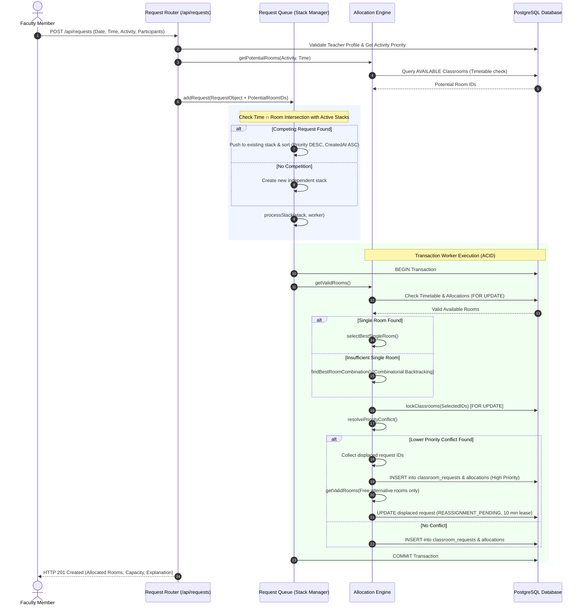

# Smart Classroom Allocation System: Constraints & Algorithms Specification

This document provides a comprehensive, authoritative specification of all **hard constraints**, **soft constraints**, **mathematical formulations**, **dynamic prioritization mechanisms**, **concurrency queues**, and **allocation algorithms** implemented in the Smart Classroom Allocation Project.

---

## 1. System Architecture & Source Map

The backend is architected around an in-memory queue coordinator, a transactional allocation engine, and a relational database schema enforcing ACID guarantees.

```
[Teacher / HOD Client]
       │
       ▼ (HTTP REST / JWT Auth)
┌─────────────────────────────────────────────────────────────┐
│ [requestRoutes.js]                                          │
│  - Input validation (Zod)                                   │
│  - Feasibility probing (getPotentialRooms)                  │
│  - Queue orchestration                                      │
└──────────────┬──────────────────────────────────────────────┘
               ▼
┌─────────────────────────────────────────────────────────────┐
│ [requestQueue.js]                                           │
│  - Competition detection (Time ∩ Classroom intersection)    │
│  - Priority + FIFO Queue Serialization                      │
│  - Active-task locking (processStack)                       │
└──────────────┬──────────────────────────────────────────────┘
               ▼
┌─────────────────────────────────────────────────────────────┐
│ [allocationEngine.js]                                       │
│  - Dynamic Activity Requirements (computers, audio, AC)     │
│  - Filter Candidate Rooms (getValidRooms)                   │
│  - Best-Fit Single Room (selectBestSingleRoom)              │
│  - Multi-Room Combinatorial Search (findBestRoomCombination)│
│  - Priority Conflict & Preemption (resolvePriorityConflict) │
│  - Strict Locking (lockClassrooms)                          │
└──────────────┬──────────────────────────────────────────────┘
               ▼
┌─────────────────────────────────────────────────────────────┐
│ PostgreSQL Database                                         │
│  - classrooms (capacities, specs, status)                   │
│  - timetable (master recurring schedules)                   │
│  - activity_priorities (dynamic priority matrix)            │
│  - classroom_requests (lifecycle states)                    │
│  - allocations (physical reservations)                      │
└─────────────────────────────────────────────────────────────┘
```

### Key Source Code References
- **Allocation Engine**: [`backend/src/services/allocationEngine.js`](file:///f:/classroomallocationproject/backend/src/services/allocationEngine.js)
- **Request Queue & Concurrency**: [`backend/src/services/requestQueue.js`](file:///f:/classroomallocationproject/backend/src/services/requestQueue.js)
- **Request Routes & Transaction Lifecycle**: [`backend/src/routes/requestRoutes.js`](file:///f:/classroomallocationproject/backend/src/routes/requestRoutes.js)
- **Admin Configuration & Priorities**: [`backend/src/routes/adminRoutes.js`](file:///f:/classroomallocationproject/backend/src/routes/adminRoutes.js)

---

## 2. Database Schema & Data Dictionary

The allocation engine interacts directly with 6 relational tables in PostgreSQL:

| Table Name | Primary Key | Key Columns | Purpose |
| :--- | :--- | :--- | :--- |
| `classrooms` | `classroom_id` | `room_number`, `building`, `capacity`, `room_type`, `ac`, `computers`, `audio_system`, `status` | Physical room assets and capabilities. |
| `timetable` | `timetable_id` | `classroom_id`, `teacher_id`, `subject`, `day_of_week`, `start_time`, `end_time`, `slot_code` | Academic master schedule that cannot be preempted. |
| `activity_priorities` | `priority_id` | `activity_type`, `priority` (integer) | Dynamic priority matrix configurable by administrators. |
| `classroom_requests` | `request_id` | `teacher_id`, `request_date`, `start_time`, `end_time`, `activity_type`, `priority`, `participants`, `status`, `reassignment_reason`, `proposed_classroom_id`, `reassignment_expires_at` | Booking request entity and lifecycle tracking. |
| `allocations` | `allocation_id` | `request_id`, `classroom_id`, `allocated_at`, `approved_by` | Join table binding requests to specific physical rooms. |
| `teachers` | `teacher_id` | `user_id`, `employee_id`, `department` | Faculty profiles linked to user credentials. |

---

## 3. System Constraints Specification

The allocation engine divides all operational rules into **Hard Constraints** (non-negotiable boundary conditions) and **Soft Constraints** (optimization objectives and tie-breakers).

```
                            ┌────────────────────────────────────────┐
                            │        Incoming Booking Request        │
                            └───────────────────┬────────────────────┘
                                                │
                 ┌──────────────────────────────┴──────────────────────────────┐
                 ▼                                                             ▼
     [ HARD CONSTRAINTS ]                                           [ SOFT CONSTRAINTS ]
  Strict Invariants (Pass / Fail)                              Optimization Objectives (Minimization)
 ──────────────────────────────────                           ────────────────────────────────────────
 1. Status = 'AVAILABLE'                                      1. Minimize Room Count (|R|)
 2. Capacity > 0                                              2. Minimize Unused Capacity (ΣCap - Part)
 3. Equipment match (Computers if software)                   3. Minimize Building Dispersion (Penalty 1000)
 4. Timetable non-collision                                   4. Minimize Floor/Room Distance (Σ|A - B|)
 5. Priority Preemption Ceiling (P_exist < P_new)             5. Lexicographical Room Number Tie-Break
 6. Aggregate Capacity >= Participants
 7. Temporal & Format Validity (Start < End)
```

### 3.1 Hard Constraints (Invariants)

An allocation or candidate room is discarded immediately if any of these conditions are violated:

#### HC1: Operational Availability
$$Status(r) = \text{'AVAILABLE'}$$
Rooms undergoing maintenance, renovation, or marked inactive in `classrooms.status` are excluded from discovery queries.

#### HC2: Strictly Positive Physical Capacity
$$Capacity(r) > 0$$
Rooms with zero or uninitialized capacity cannot be allocated to any request.

#### HC3: Equipment & Feature Requirement Matching
Let $A$ be the activity type string and $Features(r)$ be the room equipment boolean flags:
$$\text{Lower}(A) \cap \{\text{"programming"}, \text{"coding"}, \text{"software"}, \text{"computer"}\} \neq \emptyset \implies r.computers = \text{true}$$
If an activity demands computing infrastructure, any room where `computers = false` is disqualified during candidate filtering.

#### HC4: Master Timetable Inviolability
The permanent academic timetable takes absolute precedence over on-demand booking requests. A classroom $r$ cannot be allocated if:
$$\exists t \in \text{timetable} : \left( t.classroom\_id = r \land \text{Lower}(t.day\_of\_week) = \text{DayOfWeek}(request\_date) \land t.start\_time < request.end\_time \land t.end\_time > request.start\_time \right)$$
Timetable clashes are fatal and cannot be overridden regardless of the requesting teacher's activity priority.

#### HC5: Priority Preemption Ceiling
If room $r$ is already allocated to an approved booking request $E$, room $r$ can only be considered for a new request $N$ if:
$$Priority(N) > Priority(E)$$
If $Priority(E) \ge Priority(N)$, the room is strictly protected, and request $N$ cannot preempt it.

#### HC6: Total Capacity Sufficiency
For an assigned room set $R = \{r_1, r_2, \dots, r_k\}$:
$$\sum_{r \in R} Capacity(r) \ge Participants$$
The total combined capacity must be greater than or equal to the requested number of participants.

#### HC7: Temporal & Format Validity
- $start\_time < end\_time$ (non-zero positive duration).
- $request\_date$ matches ISO format `YYYY-MM-DD`.
- $start\_time$ and $end\_time$ match 24-hour time format `HH:MM`.
- $participants \in \mathbb{Z}^+$ ($participants \ge 1$).

---

### 3.2 Soft Constraints (Optimization Objectives)

When multiple room configurations satisfy all hard constraints, the engine evaluates candidates according to a strict lexicographical optimization order:

$$\text{Candidate } A \prec \text{Candidate } B \iff \begin{cases}
|R_A| < |R_B| \\
\text{or } (|R_A| = |R_B| \land UnusedCap(A) < UnusedCap(B)) \\
\text{or } (|R_A| = |R_B| \land UnusedCap(A) = UnusedCap(B) \land Proximity(A) < Proximity(B)) \\
\text{or } (\text{Tie-break by lexicographical room number})
\end{cases}$$

#### SC1: Minimum Number of Rooms ($|R|$)
Single-room allocations are strictly preferred over multi-room allocations. For multi-room combinations, a configuration with fewer rooms (e.g., 2 large rooms) is preferred over one with many small rooms (e.g., 4 small rooms) to minimize coordination overhead.

#### SC2: Minimum Unused Capacity (Fit Tightness)
$$UnusedCap(R) = \left( \sum_{r \in R} Capacity(r) \right) - Participants$$
Minimizing $UnusedCap$ ensures large auditoriums or lecture halls are conserved for larger cohorts rather than consumed by small gatherings.

#### SC3: Inter-Building Proximity (Building Clustering)
For multi-room allocations, keeping all rooms within the same building is paramount:
$$\text{BuildingPenalty}(R) = (|\{ r.building \mid r \in R \}| - 1) \times 1000$$
Crossing between buildings introduces a steep penalty of $1000$ points per additional building.

#### SC4: Intra-Building Floor & Room Proximity
Within the same building, rooms that are physically adjacent (measured by numeric room numbers) minimize student walking time:
$$\text{IntraBuildingScore}(R) = \sum_{i=1}^{|R|-1} \sum_{j=i+1}^{|R|} \mathbb{I}(r_i.building = r_j.building) \cdot |\text{int}(r_i.room\_number) - \text{int}(r_j.room\_number)|$$
The combined proximity score is:
$$ProximityScore(R) = \text{BuildingPenalty}(R) + \text{IntraBuildingScore}(R)$$

#### SC5: Deterministic Tie-Breaking
If two combinations share identical room count, unused capacity, and proximity score, tie-breaking occurs deterministically via alphabetical comparison of `room_number`:
$$r_A.room\_number.localeCompare(r_B.room\_number)$$

---

## 4. Dynamic Activity Priority Model

The system utilizes numerical priority weights ($10 - 100$) stored in the `activity_priorities` table. Administrators can adjust these weights at runtime via `PUT /api/admin/priorities/:id`.

### 4.1 System Priority Matrix

| Priority Level | Activity Type | Typical Use Case | Equipment Typical |
| :---: | :--- | :--- | :---: |
| **95** | `Coding Hackathon` | Institutional technical hackathons & competitions | Computers Required |
| **90** | `Hackathon` | General innovation and design hackathons | Standard |
| **80** | `External Event` | Accredited conferences, VIP guest events, inter-college meets | Standard / Audio |
| **70** | `Seminar` | Departmental or guest lecture series | Audio System |
| **60** | `HOD Meeting` | High-level academic & administrative meetings | Standard / AC |
| **50** | `Programming Workshop` | Technical student hands-on workshops | Computers Required |
| **40** | `Faculty Activity` | Faculty development programs, committee evaluations | Standard |
| **20** | `Extra Class` | Remedial or makeup academic lectures | Standard |
| **10** | `Other` | Informal study sessions, student club meetings | Standard |

### 4.2 Priority Comparison Semantics
- **Strict Inequality for Preemption**: An existing reservation with priority $P_{exist}$ can only be displaced by a new request if $P_{new} > P_{exist}$.
- **Equality Protection**: If $P_{new} = P_{exist}$, the first-come reservation holds its allocation ($P_{new}$ cannot displace $P_{exist}$).

---

## 5. Concurrency Engine & Request Queueing

To prevent race conditions, overselling, and deadlocks under concurrent load, the system couples **in-memory serialized queues** with **PostgreSQL row-level locking (`FOR UPDATE`)**.

```
[Request A: 10:00-11:00 Room 101, Priority 50] ──┐
                                                 ├──► [Competing Stack #1] ──► [Worker Client (FOR UPDATE)]
[Request B: 10:30-11:30 Room 101, Priority 90] ──┘         │
                                                           │ Sorted:
                                                           │ 1. Request B (P=90)
                                                           │ 2. Request A (P=50)
```

### 5.1 Competition Detection Algorithm

Two requests $A$ and $B$ are defined as **competing** if and only if both their scheduled times and their candidate room sets overlap:

$$\text{RequestsCompete}(A, B) \iff \text{TimesOverlap}(A, B) \land \text{ClassroomsOverlap}(A, B)$$

Where:
$$\text{TimesOverlap}(A, B) \iff (A.date = B.date) \land (A.start\_time < B.end\_time) \land (A.end\_time > B.start\_time)$$
$$\text{ClassroomsOverlap}(A, B) \iff \text{CandidateRooms}(A) \cap \text{CandidateRooms}(B) \neq \emptyset$$

### 5.2 Competing Stack Queue Lifecycle

1. **Detection**: Upon request submission, the system evaluates all candidate rooms through [`getPotentialRooms()`](file:///f:/classroomallocationproject/backend/src/services/allocationEngine.js#L525).
2. **Stack Placement**:
   - If the request competes with any request in an existing stack, it is inserted into that stack via [`addRequest()`](file:///f:/classroomallocationproject/backend/src/services/requestQueue.js#L53).
   - If no competing stack exists, a new stack is created via [`createStack()`](file:///f:/classroomallocationproject/backend/src/services/requestQueue.js#L31).
3. **Queue Sorting Rules**:
   - **Currently Processing Request**: Stays at index `0` until execution finishes (prevents thrashing).
   - **Waiting Requests**: Sorted in descending order of `priority`. When priorities are identical, ties are resolved using **First-In, First-Out (FIFO)** based on `createdAt`:
     $$\Delta P = Priority(B) - Priority(A)$$
     $$\text{If } \Delta P \neq 0 \implies \text{Sort by } \Delta P \text{ Descending}$$
     $$\text{Else} \implies \text{Sort by } (A.createdAt - B.createdAt) \text{ Ascending}$$
4. **Serialization & Processing**:
   - [`processStack()`](file:///f:/classroomallocationproject/backend/src/services/requestQueue.js#L144) loops sequentially over each request in the stack.
   - If another thread is already processing the stack (`stack.processing === true`), the call returns immediately; the active loop will drain newly enqueued requests.

### 5.3 Database Row-Level Locking Protocol

Within each worker execution:
1. An explicit transaction begins (`BEGIN`).
2. Candidate rooms are checked for existing approved bookings using `FOR UPDATE` on `allocations` and `classroom_requests`.
3. Selected rooms are locked explicitly using:
   ```sql
   SELECT classroom_id FROM classrooms WHERE classroom_id = ANY($1::int[]) FOR UPDATE;
   ```
4. Conflict resolution verifies that no higher-priority request committed during queue transition.
5. Inserts into `classroom_requests` and `allocations` are completed.
6. The transaction commits (`COMMIT`), releasing the row locks.

---

## 6. The Core Allocation Algorithms

The allocation process runs in three progressive stages: **Candidate Filtering**, **Single-Room Best-Fit Search**, and **Multi-Room Combinatorial Backtracking**.

```
                           ┌───────────────────────────┐
                           │    Filter Valid Rooms     │
                           │     (getValidRooms)       │
                           └─────────────┬─────────────┘
                                         │
                                         ▼
                           ┌───────────────────────────┐
                           │   Single Room Suitable?   │
                           │  Capacity >= Participants │
                           └─────────────┬─────────────┘
                                         │
                        ┌────────────────┴────────────────┐
                        │ YES                             │ NO
                        ▼                                 ▼
         ┌──────────────────────────────┐  ┌──────────────────────────────┐
         │     selectBestSingleRoom     │  │   findBestRoomCombination    │
         │  Minimizes (Cap - Part)      │  │   Combinatorial Backtracking │
         │  Deterministic Tie-Break     │  │   Pruned by Capacity & Prox  │
         └──────────────┬───────────────┘  └──────────────┬───────────────┘
                        │                                 │
                        └────────────────┬────────────────┘
                                         ▼
                           ┌───────────────────────────┐
                           │    Acquire Locks & Run    │
                           │ resolvePriorityConflict   │
                           └───────────────────────────┘
```

### 6.1 Candidate Filtering (`getValidRooms`)
Implemented in [`backend/src/services/allocationEngine.js`](file:///f:/classroomallocationproject/backend/src/services/allocationEngine.js#L33):

```javascript
async function getValidRooms(client, {
    requestDate, startTime, endTime, participants,
    activityType, priority, ignoreRequestId = null, excludeClassroomIds = []
})
```

1. Calls `getActivityRequirements(activityType)` to verify whether computers are mandatory.
2. Formats `requestDate` into day-of-week string (`Monday`, `Tuesday`, etc.).
3. Fetches all rooms where `status = 'AVAILABLE'` and `capacity > 0`.
4. Discards any room present in `excludeClassroomIds`.
5. Discards any room missing computer facilities if computers are required.
6. Queries `timetable` for overlapping slots:
   ```sql
   SELECT timetable_id FROM timetable
   WHERE classroom_id = $1
     AND LOWER(day_of_week) = LOWER($2)
     AND start_time < $4::time
     AND end_time > $3::time
   LIMIT 1;
   ```
   If a row is returned, the room is discarded.
7. Queries `allocations` for approved overlapping reservations:
   ```sql
   SELECT cr.request_id, cr.priority, cr.activity_type, a.allocation_id
   FROM allocations a
   JOIN classroom_requests cr ON a.request_id = cr.request_id
   WHERE a.classroom_id = $1
     AND cr.request_date = $2
     AND cr.status = 'APPROVED'
     AND cr.start_time < $4
     AND cr.end_time > $3
     AND ($5::int IS NULL OR cr.request_id <> $5::int)
   FOR UPDATE;
   ```
8. If any conflicting reservation has $cr.priority \ge priority$, the room is discarded.
9. If conflicts exist but all have $cr.priority < priority$, the room is kept, and the conflicts are attached for preemption processing.

---

### 6.2 Single-Room Best-Fit Algorithm (`selectBestSingleRoom`)
Implemented in [`backend/src/services/allocationEngine.js`](file:///f:/classroomallocationproject/backend/src/services/allocationEngine.js#L228):

```javascript
function selectBestSingleRoom(rooms, participants) {
    if (rooms.length === 0) return null;

    const suitableRooms = rooms.filter(
        room => Number(room.capacity) >= Number(participants)
    );

    if (suitableRooms.length === 0) return null;

    const sortedRooms = [...suitableRooms].sort((a, b) => {
        const unusedA = Number(a.capacity) - Number(participants);
        const unusedB = Number(b.capacity) - Number(participants);

        if (unusedA !== unusedB) {
            return unusedA - unusedB; // Minimum unused capacity
        }

        return a.room_number.localeCompare(b.room_number); // Lexicographical tie-break
    });

    return sortedRooms[0];
}
```

#### Time & Space Complexity
- Let $N$ be the number of valid rooms.
- Filtering: $\mathcal{O}(N)$
- Sorting: $\mathcal{O}(N \log N)$
- Auxiliary Memory: $\mathcal{O}(N)$
- Overall Time Complexity: $\mathcal{O}(N \log N)$

---

### 6.3 Multi-Room Combinatorial Backtracking (`findBestRoomCombination`)
Implemented in [`backend/src/services/allocationEngine.js`](file:///f:/classroomallocationproject/backend/src/services/allocationEngine.js#L288):

When no single room has sufficient capacity ($capacity < participants$), the engine discovers the optimal subset of rooms using combinatorial backtracking with branch-and-bound pruning.

#### Proximity Scoring Function
```javascript
function getProximityScore(selectedRooms) {
    if (selectedRooms.length <= 1) return 0;
    let score = 0;

    // Building Penalty: 1000 per extra building
    const buildings = new Set(selectedRooms.map(room => room.building));
    score += (buildings.size - 1) * 1000;

    // Distance between room numbers within same building
    for (let i = 0; i < selectedRooms.length; i++) {
        for (let j = i + 1; j < selectedRooms.length; j++) {
            if (selectedRooms[i].building === selectedRooms[j].building) {
                const roomA = parseInt(selectedRooms[i].room_number);
                const roomB = parseInt(selectedRooms[j].room_number);
                if (!Number.isNaN(roomA) && !Number.isNaN(roomB)) {
                    score += Math.abs(roomA - roomB);
                }
            }
        }
    }
    return score;
}
```

#### Candidate Comparison Metric
```javascript
function isBetterCombination(candidate, currentBest) {
    if (!currentBest) return true;

    // 1. Minimum number of rooms
    if (candidate.rooms.length !== currentBest.rooms.length) {
        return candidate.rooms.length < currentBest.rooms.length;
    }

    // 2. Minimum unused capacity
    const candidateUnused = candidate.totalCapacity - participants;
    const currentUnused = currentBest.totalCapacity - participants;
    if (candidateUnused !== currentUnused) {
        return candidateUnused < currentUnused;
    }

    // 3. Best proximity score
    return candidate.proximityScore < currentBest.proximityScore;
}
```

#### Backtracking Search Procedure
```javascript
function search(startIndex, selectedRooms, totalCapacity) {
    // Pruning / Terminal condition: Adequate capacity reached
    if (totalCapacity >= participants) {
        const candidate = {
            rooms: [...selectedRooms],
            totalCapacity,
            proximityScore: getProximityScore(selectedRooms)
        };

        if (isBetterCombination(candidate, bestCombination)) {
            bestCombination = candidate;
        }
        return; // Do not expand deeper once threshold is met
    }

    for (let i = startIndex; i < rooms.length; i++) {
        selectedRooms.push(rooms[i]);
        search(i + 1, selectedRooms, totalCapacity + Number(rooms[i].capacity));
        selectedRooms.pop(); // Backtrack
    }
}
```

#### Mathematical Properties & Pruning Efficiency
- **Search Space**: An unpruned power set of $N$ rooms is $2^N$.
- **Early Termination**: As soon as $\sum capacity \ge participants$, that subtree is evaluated and pruned without exploring larger supersets.
- **Worst-Case Complexity**: $\mathcal{O}(2^N)$ in theoretical edge cases where all rooms are needed; practical campus room sets ($N \le 30$) execute within $1-5 \text{ ms}$.

---

## 7. Priority Conflict Resolution & Preemption Workflow

When an incoming high-priority request requires a room that is already booked by an approved lower-priority request, the system executes controlled **displacement and reassignment**.

```
   [Incoming Request] (Priority 90)
           │
           ├──────────────────────────────┐
           ▼                              ▼
 [Room 101 Booked by Req #42]      [Displace Req #42]
        (Priority 20)                     │
           │                              ▼
           ▼                      [Find Alternative Room]
 [New Allocation Granted]         Only Completely Free Rooms
   Status: APPROVED               Exclude Assigned Rooms
                                          │
                                          ▼
                               [Reassignment Workflow]
                               Status: REASSIGNMENT_PENDING
                               10-minute Lease Timer
```

### 7.1 Conflict Resolution Check (`resolvePriorityConflict`)
Before committing allocations, [`resolvePriorityConflict()`](file:///f:/classroomallocationproject/backend/src/services/allocationEngine.js#L675) inspects each chosen room:

1. Retrieves all active allocations overlapping the window:
   ```sql
   SELECT cr.request_id, cr.activity_type, cr.priority, cr.status, cr.participants, cr.teacher_id, a.allocation_id
   FROM allocations a
   JOIN classroom_requests cr ON a.request_id = cr.request_id
   WHERE a.classroom_id = $1
     AND cr.request_date = $2
     AND cr.status = 'APPROVED'
     AND cr.start_time < $4
     AND cr.end_time > $3
   FOR UPDATE;
   ```
2. **Rejection Check**: If any conflict has $P_{existing} \ge P_{new}$, the transaction aborts immediately:
   $$\text{allowed} = \text{false}$$
3. **Displacement Collection**: If all conflicts have $P_{existing} < P_{new}$, the displaced records are collected and returned:
   $$\text{allowed} = \text{true}, \quad \text{displacedRequests} = [R_1, R_2, \dots]$$

### 7.2 Preventing Cascading Displacements
To prevent an infinite chain of displacements ($A$ displaces $B$, which displaces $C$, which displaces $D$...), the alternative room search for displaced requests is strictly constrained:

1. The displaced request searches for replacement rooms on the **same date and time window**.
2. **Exclusion of Newly Granted Rooms**: The rooms claimed by the high-priority request are explicitly excluded (`excludeClassroomIds`).
3. **Strictly Completely Free Rooms Only**:
   ```javascript
   const freeAlternativeRooms = alternativeRooms.filter(
       room => !room.conflictingRequests || room.conflictingRequests.length === 0
   );
   ```
   A displaced request is **never allowed to preempt a third request**, even if it has higher priority than the third request.

### 7.3 Displaced Request Lifecycle & Reassignment Lease

#### Case A: Alternative Free Room Found
1. The displaced request state updates in `classroom_requests`:
   - `status = 'REASSIGNMENT_PENDING'`
   - `proposed_classroom_id = alternativeRoom.classroom_id`
   - `reassignment_expires_at = CURRENT_TIMESTAMP + INTERVAL '10 minutes'`
   - `reassignment_reason = "Sorry, your requested room was reassigned to [Activity], which has a higher priority ([Priority]). We found an alternative room: [Building Room]. Please accept or reject the alternative room."`
2. The teacher receives a notification in the UI with a 10-minute countdown lease.

#### Case B: No Alternative Room Found
1. The displaced request state updates in `classroom_requests`:
   - `status = 'REASSIGNMENT_PENDING'`
   - `proposed_classroom_id = NULL`
   - `reassignment_expires_at = NULL`
   - `reassignment_reason = "Sorry, your requested room was reassigned to [Activity], which has a higher priority ([Priority]). No suitable alternative classroom is available on this day. Please search for another day."`

---

### 7.4 Teacher Reassignment Actions

#### Accept Alternative (`POST /api/requests/reassignments/:requestId/accept`)
- Implemented in [`backend/src/routes/requestRoutes.js`](file:///f:/classroomallocationproject/backend/src/routes/requestRoutes.js#L967).
- Begins a transaction with row-level locks on the request and proposed classroom:
  ```sql
  SELECT * FROM classroom_requests WHERE request_id = $1 FOR UPDATE;
  SELECT classroom_id FROM classrooms WHERE classroom_id = $1 FOR UPDATE;
  ```
- **Validation Checks**:
  - Validates `status === 'REASSIGNMENT_PENDING'`.
  - Validates `proposed_classroom_id` is present.
  - Validates lease expiry: `reassignment_expires_at > CURRENT_TIMESTAMP`. If expired, returns HTTP `409 Conflict`.
  - Re-verifies room availability to ensure no race condition claimed the room in the interim.
- **Commit**:
  - Updates `allocations.classroom_id` to `proposed_classroom_id`.
  - Updates `classroom_requests.status = 'APPROVED'`.
  - Clears `proposed_classroom_id`, `reassignment_reason`, and `reassignment_expires_at`.

#### Reject Alternative (`POST /api/requests/reassignments/:requestId/reject`)
- Implemented in [`backend/src/routes/requestRoutes.js`](file:///f:/classroomallocationproject/backend/src/routes/requestRoutes.js#L1141).
- Updates `classroom_requests.status = 'REJECTED'`.
- Clears reassignment fields.

---

## 8. Complete End-to-End Sequence Diagram



---

## 9. Edge Cases & Resilience Safeguards

| Scenario | System Behavior | Safeguard Mechanism |
| :--- | :--- | :--- |
| **Simultaneous Requests for the Same Room** | The requests are grouped into the same competing stack. The higher-priority request runs first; the second re-checks database state and chooses a different room. | In-memory stack serialization + `FOR UPDATE` row lock. |
| **Equal Priority Collision** | First request to reach the database acquires the lock; subsequent request is rejected or directed to multi-room. | Priority Preemption requires strict inequality ($P_{new} > P_{exist}$). |
| **Room Insufficient for Large Audience** | Automatically switches to multi-room allocation mode without user intervention. | Automatic threshold trigger in [`requestRoutes.js`](file:///f:/classroomallocationproject/backend/src/routes/requestRoutes.js#L358). |
| **Multi-Room Spanning Buildings** | Evaluates proximity penalty ($(B - 1) \times 1000$) to keep all sections within the same physical building. | Proximity score heuristic in [`findBestRoomCombination`](file:///f:/classroomallocationproject/backend/src/services/allocationEngine.js#L301). |
| **Displaced Booking Cannot Find Alternative Room** | Marked as `REASSIGNMENT_PENDING` with `proposed_classroom_id = NULL`. Teacher is prompted to select another date. | Safe null handling preventing phantom assignments. |
| **Displaced Alternative Room Not Claimed in 10 Minutes** | The acceptance endpoint validates `reassignment_expires_at < CURRENT_TIMESTAMP` and rejects late acceptance with HTTP 409. | Timestamp comparison on `reassignment_expires_at`. |
| **Transaction Failure or Crash** | The entire batch is rolled back (`ROLLBACK`), releasing all database locks and rejecting the queue promise cleanly. | `try ... catch ... finally` wrapping database connection release. |

---

## 10. Summary Matrix: Mathematical Objective Summary

$$\min_{R \subseteq \mathcal{C}} \quad \Phi(R) = \mathbf{w}_1 \cdot |R| + \mathbf{w}_2 \cdot \left( \sum_{r \in R} \text{Cap}(r) - \text{Part} \right) + \mathbf{w}_3 \cdot \text{Proximity}(R)$$

$$\text{Subject to:}$$

$$\begin{aligned}
1. & \quad \sum_{r \in R} \text{Cap}(r) \ge \text{Part} \\
2. & \quad \forall r \in R: \text{Status}(r) = \text{'AVAILABLE'} \land \text{Cap}(r) > 0 \\
3. & \quad \forall r \in R: \text{Requirements}(Activity) \subseteq \text{Features}(r) \\
4. & \quad \forall r \in R: \text{TimetableOverlap}(r, Date, Start, End) = \emptyset \\
5. & \quad \forall r \in R, \forall e \in \text{ExistingBookings}(r): Priority(Request) > Priority(e)
\end{aligned}$$

This ensures maximum space utilization, complete operational reliability, and equitable priority-driven classroom allocation across the institution.
