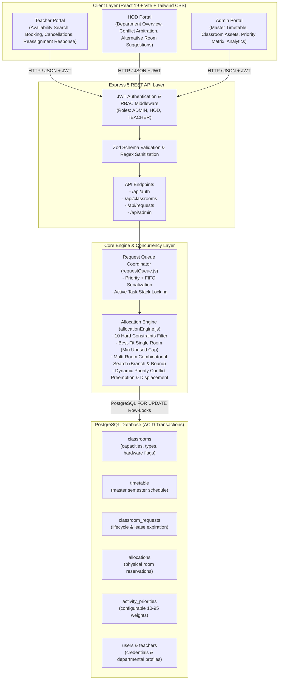

# Timetable-Aware Automated Classroom Allocation System

[](LICENSE)
[](https://nodejs.org/)
[](https://expressjs.com/)
[](https://www.postgresql.org/)
[](https://react.dev/)
[](https://vitejs.dev/)
[](https://tailwindcss.com/)
[](#academic-research--paper)

> A full-stack, constraint-driven resource scheduling platform for university campuses. Solves ad-hoc classroom allocation challenges through strict academic timetable inviolability, combinatorial multi-room backtracking, priority-based conflict preemption, high-concurrency transactional locking, and modern role-tailored dashboards.

---

## 📌 Table of Contents

- [Overview & Motivation](#-overview--motivation)
- [System Architecture](#-system-architecture)
- [⚙️ Backend Architecture & Engine Deep-Dive](#️-backend-architecture--engine-deep-dive)
  - [1. Backend Modules & Services](#1-backend-modules--services)
  - [2. Allocation Engine (`allocationEngine.js`)](#2-allocation-engine-allocationenginejs)
  - [3. Concurrency & Queue Manager (`requestQueue.js`)](#3-concurrency--queue-manager-requestqueuejs)
  - [4. Database Schema & Data Dictionary](#4-database-schema--data-dictionary)
  - [5. Complete Backend REST API Reference](#5-complete-backend-rest-api-reference)
  - [6. Backend Scripts & Utilities](#6-backend-scripts--utilities)
- [💻 Frontend Architecture & UI Features](#-frontend-architecture--ui-features)
  - [1. Role-Tailored Dashboards](#1-role-tailored-dashboards)
  - [2. Tech Stack & Styling](#2-tech-stack--styling)
- [Repository Structure](#-repository-structure)
- [🚀 Complete Setup & Installation Guide](#-complete-setup--installation-guide)
  - [Prerequisites](#prerequisites)
  - [Step 1: Database Setup (PostgreSQL)](#step-1-database-setup-postgresql)
  - [Step 2: Backend Setup & Execution](#step-2-backend-setup--execution)
  - [Step 3: Frontend Setup & Execution](#step-3-frontend-setup--execution)
- [🔑 Default Demo Credentials](#-default-demo-credentials)
- [🧪 Automated Verification & Test Suite](#-automated-verification--test-suite)
- [📐 Core Constraints & Mathematical Formulation](#-core-constraints--mathematical-formulation)
- [🎓 Academic Research & Paper](#-academic-research--paper)
- [👥 Authors & Acknowledgments](#-authors--acknowledgments)

---

## 📖 Overview & Motivation

In modern engineering institutions, campus physical infrastructure faces constant, competing demands. Beyond semester-wide master timetables, faculty and student organizations routinely require classrooms for ad-hoc events—such as hackathons, coding workshops, remedial lectures, recruitment drives, and departmental meetings.

Traditional room allocation relies on static forms, spreadsheets, or manual room picking by faculty, leading to chronic operational issues:

1. **Curriculum Timetable Collisions:** Ad-hoc reservations clash with regular curriculum lectures, displacing students and wasting instructional hours.
2. **Facility & Equipment Mismatches:** Programming sessions get assigned to regular lecture halls lacking desktop machines, while theoretical lectures unnecessarily occupy specialized computing labs.
3. **Severe Capacity Fragmentation:** Small cohorts of 20 students book 120-seat lecture theaters, starving large gatherings of adequate space.
4. **First-Come, First-Served (FCFS) Failures:** Low-priority informal study sessions block critical events like campus placement drives or accredited symposiums.
5. **No Multi-Room Synthesis:** When participant counts exceed single room limits (e.g., 150+ participants), organizers have to manually search for scattered rooms across different buildings without proximity guarantees.

The **Timetable-Aware Automated Classroom Allocation System** solves this NP-hard scheduling problem. Teachers enter event constraints (date, time window, cohort size, activity classification, and justification), while the backend engine computes the mathematically optimal room assignment under strict academic constraints.

---

## 🏗️ System Architecture



---

## ⚙️ Backend Architecture & Engine Deep-Dive

The backend is an enterprise-grade, transactional engine written in **Node.js (Express 5)** backed by a **PostgreSQL** database ensuring ACID guarantees.

### 1. Backend Modules & Services

- **`src/server.js`**: Express server bootstrap, middleware registration (CORS, JSON body parser), health probes, and automatic migration verification.
- **`src/middleware/auth.js`**:
  - `authenticateToken`: Validates incoming Bearer JWT tokens in request headers.
  - `authorizeRoles(...roles)`: Enforces Role-Based Access Control (RBAC) ensuring users only access endpoints authorized for `ADMIN`, `HOD`, or `TEACHER`.
- **`src/db/db.js`**: Connection pool manager utilizing `pg.Pool` with connection reuse and error handling.
- **`src/db/migrate.js`**: Automatically updates table structures, adds multi-room columns, and configures status check constraints.

---

### 2. Allocation Engine (`allocationEngine.js`)

The allocation engine solves the classroom scheduling problem using a formal dual-constraint framework:

1. **Candidate Room Filtering (`getValidRooms`):**
   - Eliminates rooms undergoing maintenance (`status != 'AVAILABLE'`).
   - Filters out rooms with zero capacity.
   - Dynamically inspects activity strings: if the activity contains keywords like *programming*, *coding*, *software*, or *computer*, it enforces `computers = true`.
   - Checks against the master `timetable` table for the corresponding day of the week to ensure **zero curriculum clashes**.
   - Identifies active reservations from `allocations` and evaluates whether incoming request priority exceeds existing reservation priority ($Priority_{new} > Priority_{existing}$).

2. **Best-Fit Single Room Allocation (`selectBestSingleRoom`):**
   - Identifies all valid rooms with $Capacity(r) \ge Participants$.
   - Evaluates fit tightness by minimizing unused capacity:
     $$\text{Unused Capacity} = Capacity(r) - Participants$$
   - Breaks ties lexicographically by room number.

3. **Combinatorial Multi-Room Search (`findBestRoomCombination`):**
   - Activated when no single room satisfies the cohort or when split allocation is permitted (`splittable = true`).
   - Implements a recursive branch-and-bound backtracking algorithm.
   - Evaluates combinations based on:
     - **Minimum Room Count ($|R|$):** Fewer larger rooms preferred over many smaller rooms.
     - **Minimum Unused Capacity:** Tightest total seat fit.
     - **Proximity Score:** Strictly penalizes rooms scattered across different buildings (penalty weight: 1,000) and minimizes floor/room distance.

4. **Priority Conflict Resolution & Displacement (`resolvePriorityConflict`):**
   - When all rooms are occupied, the engine checks whether a higher-priority request can preempt an existing lower-priority booking.
   - Preemption strictly enforces $Priority_{new} > Priority_{existing}$.
   - Displaced requests transition to `REASSIGNMENT_PENDING` with an automated 10-minute lease window, allowing faculty to accept alternative rooms.

5. **HOD Alternative Search (`findAlternativeClassrooms`):**
   - Provides departmental leadership with valid alternative rooms while strictly excluding the disputed room and without prematurely releasing existing bookings.

---

### 3. Concurrency & Queue Manager (`requestQueue.js`)

To prevent race conditions and double allocations when multiple users submit requests simultaneously:
- **In-Memory Request Queue:** Serializes competing requests based on priority score (highest first) followed by arrival timestamp (FIFO).
- **PostgreSQL Row-Level Locks (`FOR UPDATE`):**
  ```sql
  SELECT classroom_id FROM classrooms WHERE classroom_id = $1 FOR UPDATE;
  ```
  Candidate classrooms are locked within an active database transaction (`BEGIN ... COMMIT`), guaranteeing strict serializability and preventing concurrent collisions.

---

### 4. Database Schema & Data Dictionary

The system operates across 7 relational tables in PostgreSQL:

| Table Name | Primary Key | Key Columns | Purpose |
| :--- | :--- | :--- | :--- |
| `users` | `user_id` | `name`, `email`, `password` (bcrypt), `role` (`ADMIN`, `HOD`, `TEACHER`) | User authentication and RBAC credentials. |
| `teachers` | `teacher_id` | `user_id`, `employee_id`, `department` | Faculty profiles linked to users. |
| `classrooms` | `classroom_id` | `room_number`, `building`, `room_type`, `capacity`, `ac`, `computers`, `audio_system`, `status` | Physical room assets and technical specs. |
| `timetable` | `timetable_id` | `classroom_id`, `teacher_id`, `subject`, `day_of_week`, `start_time`, `end_time`, `schedule_type`, `slot_code` | Authoritative semester master schedule (inviolable). |
| `activity_priorities` | `priority_id` | `activity_type`, `priority` (integer 0–100) | Dynamic priority matrix managed by administrators. |
| `classroom_requests` | `request_id` | `teacher_id`, `request_date`, `start_time`, `end_time`, `activity_type`, `priority`, `participants`, `status`, `reassignment_reason`, `proposed_classroom_id`, `reassignment_expires_at` | Reservation entity and complete lifecycle state machine. |
| `allocations` | `allocation_id` | `request_id`, `classroom_id`, `allocated_at`, `approved_by` | Join table mapping approved requests to physical rooms. |

---

### 5. Complete Backend REST API Reference

#### 🔐 Authentication Endpoints (`/api/auth`)

##### `POST /api/auth/login`
Authenticates user credentials and issues a signed JWT.
- **Request Body:**
  ```json
  {
    "email": "kumar@college.com",
    "password": "teacher123"
  }
  ```
- **Response (200 OK):**
  ```json
  {
    "message": "Login successful",
    "token": "eyJhbGciOiJIUzI1NiIsInR5cCI6...",
    "user": {
      "user_id": 2,
      "name": "Dr. Kumar (Faculty)",
      "email": "kumar@college.com",
      "role": "TEACHER"
    }
  }
  ```

---

#### 🏫 Classroom & Availability Endpoints (`/api/classrooms`)

##### `GET /api/classrooms/available`
Probes non-colliding classrooms for a given date and time window.
- **Headers:** `Authorization: Bearer <token>`
- **Query Parameters:** `date` (YYYY-MM-DD), `start_time` (HH:MM), `end_time` (HH:MM)
- **Response (200 OK):**
  ```json
  {
    "total": 6,
    "classrooms": [
      {
        "classroom_id": 1,
        "room_number": "SJT 101",
        "building": "Silver Jubilee Tower",
        "capacity": 60,
        "ac": true,
        "computers": false,
        "audio_system": true,
        "status": "AVAILABLE"
      }
    ]
  }
  ```

---

#### 📝 Request & Allocation Endpoints (`/api/requests`)

##### `POST /api/requests`
Submits an ad-hoc reservation request. Automatically triggers the allocation solver.
- **Headers:** `Authorization: Bearer <token>`
- **Request Body:**
  ```json
  {
    "request_date": "2026-10-15",
    "start_time": "10:00",
    "end_time": "12:00",
    "activity_type": "Hackathon",
    "participants": 80,
    "reason": "Annual CSE Intra-College Hackathon"
  }
  ```
- **Response (201 Created):**
  ```json
  {
    "message": "Classroom allocated successfully",
    "allocation": {
      "request_id": 42,
      "status": "APPROVED",
      "allocated_classrooms": [
        { "classroom_id": 6, "room_number": "SJT 301", "building": "Silver Jubilee Tower", "capacity": 80 }
      ]
    }
  }
  ```

##### `GET /api/requests/my-requests`
Retrieves all requests submitted by the authenticated faculty member.

##### `GET /api/requests/timetable`
Retrieves regular curriculum timetable entries for the authenticated teacher.

##### `PUT /api/requests/:id/cancel`
Voluntarily cancels an approved request and atomically releases all allocated rooms.

##### `POST /api/requests/:id/respond-reassignment`
Allows a teacher to accept or reject an alternative room proposed by an automated displacement or HOD suggestion.
- **Request Body:** `{ "action": "ACCEPT" }` or `{ "action": "REJECT" }`

##### `GET /api/requests/hod/overview`
*(HOD Role Only)* Lists department-wide requests, active allocations, and pending reassignments.

##### `POST /api/requests/hod/:id/suggest-alternative`
*(HOD Role Only)* Suggests an alternative classroom candidate to resolve scheduling contention.

---

#### ⚙️ Administration Endpoints (`/api/admin`)

*(Requires `ADMIN` Role)*

- **Classrooms Inventory:**
  - `GET /api/admin/classrooms` - List all physical rooms.
  - `POST /api/admin/classrooms` - Create a new classroom asset.
  - `PUT /api/admin/classrooms/:id` - Update room details, capacities, or operational status.
- **Master Timetable Management:**
  - `GET /api/admin/timetable` - Fetch entire institution master schedule.
  - `POST /api/admin/timetable` - Add a recurring curriculum timetable entry.
  - `DELETE /api/admin/timetable/:id` - Delete a curriculum schedule slot.
- **Activity Priorities:**
  - `GET /api/admin/priorities` - View the priority matrix.
  - `PUT /api/admin/priorities/:id` - Dynamically adjust the priority score of an activity.

---

### 6. Backend Scripts & Utilities

- **`node updatePasswords.js`**: Hashes plaintext passwords with `bcrypt` (salt rounds: 10) and syncs them with pre-seeded database users.
- **`node hashPasswords.js`**: Utility script to generate a bcrypt hash from any input string.
- **`node test-workflow.js`**: Comprehensive automated test runner executing 5 real-world allocation and cancellation test scenarios.

---

## 💻 Frontend Architecture & UI Features

Built with **React 19**, **Vite**, and **Tailwind CSS v4**, the frontend provides responsive, interactive, role-specific interfaces.

### 1. Role-Tailored Dashboards

1. **Faculty / Teacher Portal (`src/App.jsx`):**
   - Interactive availability search with real-time feedback.
   - Dynamic booking submission form with instant constraint feedback.
   - View my curriculum timetable and active ad-hoc bookings.
   - Modal confirmation for voluntary cancellations with immediate room release.
   - Action banner for reassignment notifications with 1-click Accept / Reject.

2. **Head of Department Portal (`src/HodDashboard.jsx`):**
   - Department-wide operational dashboard.
   - Request review table with status badges (`APPROVED`, `PENDING`, `REASSIGNMENT_PENDING`, `CANCELLED`).
   - Alternative classroom suggestion modal powered by backend candidate exclusion logic.

3. **System Administrator Dashboard (`src/AdminDashboard.jsx`):**
   - **Classroom Asset Manager:** Add/edit rooms, toggle AC, computers, and audio system flags, and set maintenance status.
   - **Timetable Scheduler:** Master timetable editor preventing collisions before semesters begin.
   - **Priority Matrix Slider:** Dynamically configure priority levels (e.g., set *Semester Exam* to 95, *Workshop* to 70).

### 2. Tech Stack & Styling

- **React 19** with clean state hooks (`useState`, `useEffect`).
- **Tailwind CSS v4** for clean, modern aesthetics, smooth transitions, and card layouts.
- **Zero Heavy UI Libraries:** Fast bundle size and lightning-fast load times.

---

## 📂 Repository Structure

```text
classroom-availability-system/
├── backend/                          # Express 5 REST API & Allocation Engine
│   ├── src/
│   │   ├── db/
│   │   │   ├── db.js                 # PostgreSQL connection pool
│   │   │   └── migrate.js            # Table migrations & status constraints
│   │   ├── middleware/
│   │   │   └── auth.js               # JWT verification & RBAC authorization
│   │   ├── routes/
│   │   │   ├── adminRoutes.js        # Timetable, classrooms, priorities CRUD
│   │   │   ├── authRoutes.js         # User login & token generation
│   │   │   ├── classroomRoutes.js    # Classroom availability probing
│   │   │   └── requestRoutes.js      # Allocation execution & reassignment
│   │   ├── services/
│   │   │   ├── allocationEngine.js   # Constraint satisfaction & optimization solver
│   │   │   └── requestQueue.js       # Serialized FIFO + Priority concurrency queue
│   │   └── server.js                 # Server entry point & startup checks
│   ├── .env.example                  # Environment configuration blueprint
│   ├── hashPasswords.js              # Password hashing helper script
│   ├── updatePasswords.js            # Seed/update default user passwords
│   ├── test-workflow.js              # Integration test suite runner
│   ├── package.json                  # Backend dependencies and scripts
│   └── README.md                     # Dedicated backend documentation
├── frontend/                         # React 19 + Vite + Tailwind CSS Client
│   ├── public/                       # Static public assets (SVG icons, favicons)
│   ├── src/
│   │   ├── AdminDashboard.jsx        # Administrator management portal
│   │   ├── HodDashboard.jsx          # Departmental conflict resolution portal
│   │   ├── App.jsx                   # Faculty booking portal & login
│   │   ├── App.css                   # Custom CSS styling
│   │   ├── index.css                 # Tailwind CSS v4 directives
│   │   └── main.jsx                  # React application root
│   ├── package.json                  # Frontend dependencies and scripts
│   ├── vite.config.js                # Vite build and dev configuration
│   └── README.md                     # Dedicated frontend documentation
├── database_schema.sql               # Ready-to-run PostgreSQL DDL & Seed Data
├── CONSTRAINTS_AND_ALGORITHMS.md     # In-depth mathematical & algorithmic specification
├── IEEE_Conference_Paper.tex         # Complete IEEE conference research paper source
└── README.md                         # Project documentation (this file)
```

---

## 🚀 Complete Setup & Installation Guide

### Prerequisites

Ensure you have installed:
- [Node.js](https://nodejs.org/) (version 18 or higher)
- [PostgreSQL](https://www.postgresql.org/) (version 14 or higher)
- Git

---

### Step 1: Database Setup (PostgreSQL)

1. Open your PostgreSQL terminal (`psql`) or pgAdmin and create the database:
   ```sql
   CREATE DATABASE classroom_allocation;
   ```

2. Execute the included [`database_schema.sql`](database_schema.sql) script to create all tables, constraints, foreign keys, and seed data:
   ```bash
   psql -U postgres -d classroom_allocation -f database_schema.sql
   ```
   *(Or copy the contents of `database_schema.sql` into pgAdmin's Query Tool and click Execute).*

---

### Step 2: Backend Setup & Execution

1. Open a terminal and navigate to `backend`:
   ```bash
   cd backend
   ```

2. Install backend dependencies:
   ```bash
   npm install
   ```

3. Configure environment variables:
   Copy `.env.example` to `.env`:
   ```bash
   cp .env.example .env
   ```
   Verify that `.env` contains your PostgreSQL credentials:
   ```env
   PORT=5000
   DB_USER=postgres
   DB_HOST=localhost
   DB_NAME=classroom_allocation
   DB_PASSWORD=your_postgres_password
   DB_PORT=5432
   JWT_SECRET=classroom_allocation_secret_2026
   ```

4. Initialize/sync user passwords in PostgreSQL:
   ```bash
   node updatePasswords.js
   ```

5. Start the backend API:
   ```bash
   # Development mode with hot-reloading
   npm run dev

   # Or production mode
   npm start
   ```
   The backend API will run on **`http://localhost:5000`**.

---

### Step 3: Frontend Setup & Execution

1. Open a second terminal and navigate to `frontend`:
   ```bash
   cd frontend
   ```

2. Install frontend dependencies:
   ```bash
   npm install
   ```

3. Start the Vite development server:
   ```bash
   npm run dev
   ```

4. Open your browser at **`http://localhost:5173`**.

---

## 🔑 Default Demo Credentials

The database comes pre-populated with ready-to-test credentials across all roles:

| Role | Email | Password | Access & Responsibilities |
| :--- | :--- | :--- | :--- |
| **System Administrator** | `admin@college.com` | `admin123` | Master timetable editor, classroom assets CRUD, priority weight slider |
| **HOD (Computer Science)** | `hod@college.com` | `hod123` | Departmental overview, conflict mediation, alternative room proposals |
| **Faculty 1** | `kumar@college.com` | `teacher123` | Room availability search, booking requests, voluntary cancellations |
| **Faculty 2** | `priya@college.com` | `teacher456` | Room availability search, booking requests, voluntary cancellations |

---

## 🧪 Automated Verification & Test Suite

The repository includes an end-to-end test suite in `backend/test-workflow.js` validating key engine operations:
1. **Single-Room Cancellation:** Teacher cancels request $\rightarrow$ allocations instantly released.
2. **Multi-Room Cancellation:** Teacher cancels 3-room request $\rightarrow$ all 3 allocations released atomically.
3. **HOD Alternative Room Search:** Finds alternative rooms while protecting existing reservations from premature release.
4. **HOD Suggestion & Acceptance:** Teacher accepts alternative $\rightarrow$ atomic switch from old room to suggested room.
5. **Teacher Rejection:** Teacher rejects proposal $\rightarrow$ status flags updated and original room remains safeguarded.

Run the test suite:
```bash
cd backend
node test-workflow.js
```

---

## 📐 Core Constraints & Mathematical Formulation

The engine enforces a rigorous dual-constraint model detailed in [`CONSTRAINTS_AND_ALGORITHMS.md`](CONSTRAINTS_AND_ALGORITHMS.md):

### Hard Constraints (Strict Invariants)
- **HC1 (Operational Availability):** $Status(r) = \text{'AVAILABLE'}$.
- **HC2 (Positive Capacity):** $Capacity(r) > 0$.
- **HC3 (Equipment Matching):** Software/programming activities strictly demand $computers = \text{true}$.
- **HC4 (Timetable Inviolability):** Master semester schedule slots can **never** be preempted.
- **HC5 (Priority Preemption Ceiling):** Existing reservations can only be displaced if $Priority_{new} > Priority_{existing}$.
- **HC6 (Capacity Sufficiency):** $\sum_{r \in R} Capacity(r) \ge Participants$.
- **HC7 (Temporal Order):** $Start < End$ within valid operating hours.

### Soft Constraints (Optimization Objectives)
When multiple room combinations satisfy all hard constraints:
1. **Minimum Room Count ($|R|$):** Single rooms are strictly prioritized over multi-room splits.
2. **Minimum Unused Capacity:** Minimizes $(\sum Capacity - Participants)$ to prevent capacity waste.
3. **Minimum Building Dispersion:** Heavy penalty ($1,000$) against allocating rooms across different buildings.
4. **Floor & Room Proximity:** Minimizes the physical distance between rooms in multi-room configurations.

---

## 🎓 Academic Research & Paper

This project represents our final-year engineering capstone project in Computer Science and Engineering. The full research paper is written in IEEE conference format:

- **Paper Title:** *Design and Implementation of a Timetable-Aware Automated Classroom Allocation System: A Final-Year Engineering Capstone Project*
- **LaTeX Source:** [`IEEE_Conference_Paper.tex`](IEEE_Conference_Paper.tex)
- **Mathematical Specification:** [`CONSTRAINTS_AND_ALGORITHMS.md`](CONSTRAINTS_AND_ALGORITHMS.md)

---

## 👥 Authors & Acknowledgments

- **Sivasurya** - Final-Year B.Tech. Candidate, Department of Computer Science and Engineering
- **Shree Ram** - Final-Year B.Tech. Candidate, Department of Computer Science and Engineering
- **Rajesh** - Final-Year B.Tech. Candidate, Department of Computer Science and Engineering

Developed under the supervision of the Department of Computer Science and Engineering.

---

## 📄 License

This project is licensed under the [MIT License](LICENSE).
